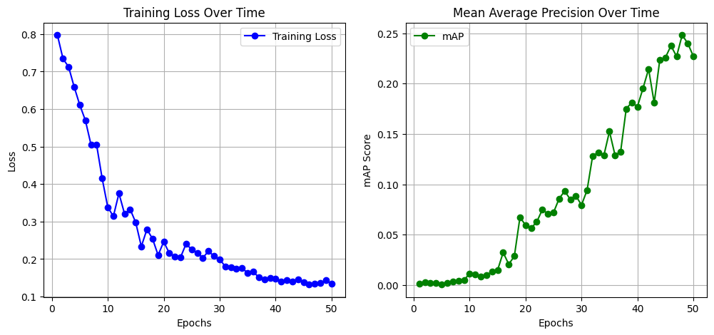

# YOLOv1 Reimplementation

This project is a reimplementation of the original YOLOv1 (You Only Look Once) object detection model from the paper:

> Redmon, J., Divvala, S., Girshick, R., & Farhadi, A. (2016). *You Only Look Once: Unified, Real-Time Object Detection*. CVPR. [[Paper](https://arxiv.org/abs/1506.02640)]

## Features
- Fully reimplemented from scratch
- Trained on the Pascal VOC dataset
- Custom loss function based on the original YOLOv1 formulation
- Supports training and evaluation with visualization tools

## Installation
```sh
# Clone the repository
git clone https://github.com/yourusername/yolo-v1-reimplementation.git
cd yolo-v1-reimplementation

# Install dependencies
pip install -r requirements.txt
```

## Usage
### Training
```sh
python train.py --epochs 100 --batch_size 32 --lr 0.001
```

### Evaluation
```sh
python evaluate.py --weights path/to/weights.pth
```

### Inference
```sh
python detect.py --image path/to/image.jpg --weights path/to/weights.pth
```

## Model Architecture
The model follows the original YOLOv1 architecture, consisting of:
- Feature extraction using a convolutional backbone
- Detection head for predicting bounding boxes, objectness, and class scores

## Training Progress
Below is the training progress graph showing the loss and mAP (Mean Average Precision) over epochs.



## Results
| Metric  | Value  |
|---------|--------|
| mAP     | 51.44% |
| Loss    | 0.1049 |

## References
- [YOLOv1 Paper](https://arxiv.org/abs/1506.02640)
- [Original YOLO Implementation](https://github.com/pjreddie/darknet)

## License
This project is licensed under the MIT License.

